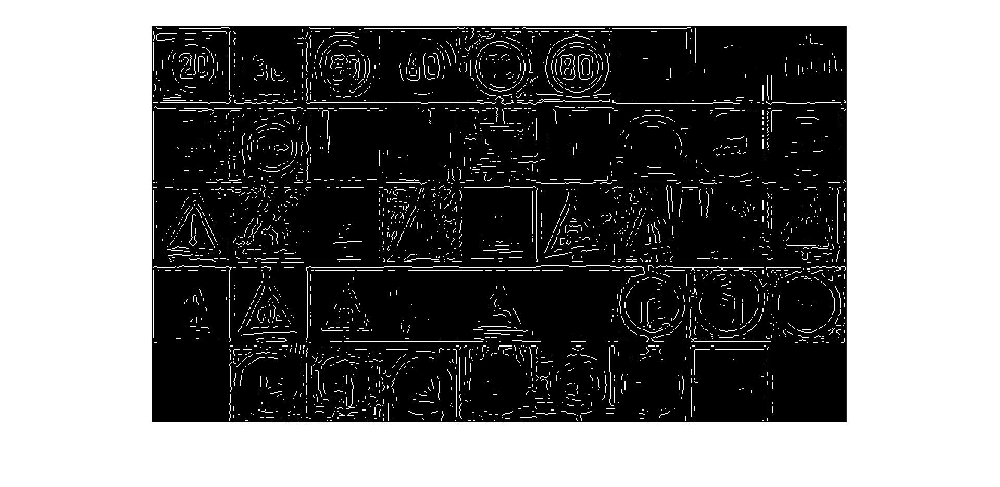
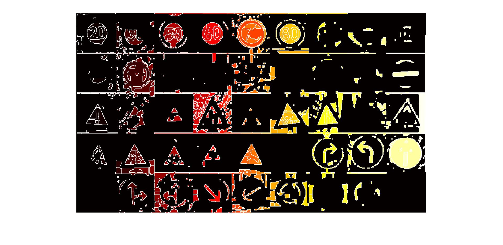
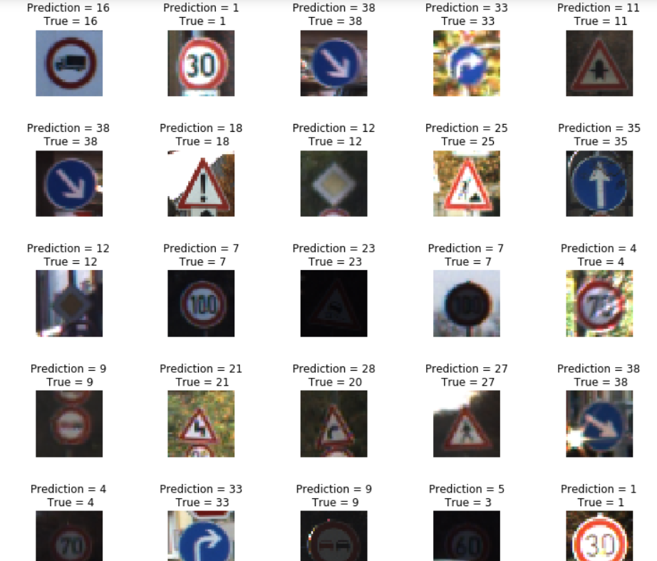

# CSE-4019-19BCE2186

**J component of CSE-4019**

**Project Name**: Traffic Sign Classification

**Project Arena**: Laplacian filter and Segmentation

## completion

we see a normal sample image

the edges are detected by LAPLACIAN filter

on segmenting the image it higlights the inner space of the signs.

Final result as it depects and recognises Traffic signs on training

**Image Dataset** = [link](https://bitbucket.org/jadslim/german-traffic-signs/src/master/)
